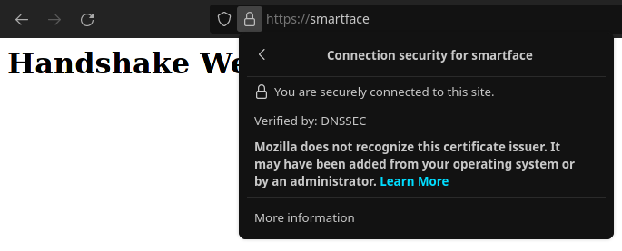

**Posts in this series:**

1. [Introduction]()
2. [Part 1 - Set up DNS server]()
3. [Part 2 - Set up Web server]()
4. Part 3 - Secure with DANE (this one!)

---

# Secure with DANE

If you're following with the series, we have a website reachable with a
Handshake domain, but it's only over HTTP and not secure.

With regular domains, one would request a Certificate Authority (CA) to sign our
certificate and then use it on the web server.

In Handshake, we replace that dependancy on CAs with DNS itself, which is
secured by blockchain. This is possible with DANE (DNS-based Authentication of
Named Entities), which is much older than Handshake. A hash of the certificate's
public key is placed in a TLSA DNS record and is used by end-users to verify the
certificate (instead of checking if the certificate is signed by a CA).

So we have 2 things to do now: generate a self-signed certificate and add its
hash to zone on the DNS server.

## Generate a certificate

Buffrr has a nice
[one-liner](https://gist.github.com/buffrr/609285c952e9cb28f76da168ef8c2ca6)
that does this with RSA keys. This is a modified version for ECDSA:

> Remember to replace `smartface` with your domain name in 3 places!

```sh
openssl req -x509 -newkey ec:<(openssl ecparam -name secp521r1) -days 365 -nodes \
  -keyout cert.key -out cert.crt -extensions ext  -config \
  <(echo "[req]";
    echo distinguished_name=req;
    echo "[ext]";
    echo "keyUsage=critical,digitalSignature,keyEncipherment";
    echo "extendedKeyUsage=serverAuth";
    echo "basicConstraints=critical,CA:FALSE";
    echo "subjectAltName=DNS:smartface,DNS:*.smartface";
    ) -subj "/CN=*.smartface"
```

After running this, 2 files will be created: `cert.key` (private key) and
`cert.crt` (public key). **Back these up**.

While we have these certificates, we'll calculate a TLSA record (used in the
next section). Take a note of the output of:

```sh
echo -n "3 1 1 " && openssl x509 -in cert.crt -pubkey -noout | openssl pkey -pubin -outform der | openssl dgst -sha256 -binary | xxd  -p -u -c 32
```

Then move them to `/etc/ssl/`:

```sh
sudo mv cert.key /etc/ssl/smartface.key
sudo mv cert.crt /etc/ssl/smartface.crt
```

## Configure nginx

Edit the site config file we created earlier
`/etc/nginx/sites-available/smartface` and add these lines to enable TLS:

```
server {
  # ...previous content here

  listen 443 ssl;
  ssl_certificate /etc/ssl/smartface.crt;
  ssl_certificate_key /etc/ssl/smartface.key;
}
```

Test to see if the configuration file is okay and restart nginx if there are no
errors:

```sh
sudo nginx -t && sudo systemctl restart nginx
```

## Add TLSA record

Now that we have a certificate, its hash needs to be added to the DNS zone.
Remember the TLSA record we noted down after generating the certificate? We'll
add that record with:

```sh
sudo -u pdns pdnsutil add-record smartface. _443._tcp TLSA '3 1 1 03ED84FCD533CD930D46B1D219263BF3EC027F4E927143EE805A43C7422041A9'

# call rectify-zone to calculate ordering
sudo -u pdns pdnsutil rectify-zone smartface
```

## That's it!

The website is ready and can be browsed securely. If you don't have
[Fingertip](https://github.com/imperviousinc/fingertip) yet, give it a try -
especially its auto-configure option that sets up the browser and OS
automatically.

If you have Fingertip ready, then visit https://smartface/ (well, your domain,
not this one) to see your website!



---

Hope you liked the series. Feel free to ping me on
[Telegram](https://t.me/rithvikvibhu) or Discord (xnf0k#5179) to give feedback
or to fix incorrect details, or for anything related to Handshake.

You may also want to join Handshake groups on
[Telegram](https://t.me/handshake_hns) and
[Discord](https://discord.gg/AtqtxGckqX) to show off your shiny new website :D
